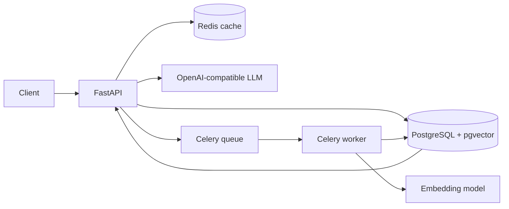

# RAG Knowledge API

A production-style Retrieval-Augmented Generation backend built with **FastAPI, PostgreSQL + pgvector, Redis, Celery, and OpenAI-compatible models**.

This project demonstrates the backend architecture behind an AI knowledge assistant: document ingestion, chunking, embeddings, vector retrieval, grounded answer generation, caching, background processing, tests, and containerized local infrastructure.

## Why this project exists

Most real AI products are more than a prompt sent to an LLM. They need reliable APIs, background jobs, retrieval quality, persistence, caching, observability, and clear failure handling.

This repository is designed as a public engineering sample of those systems.

## Architecture



## Core features

- FastAPI REST API with automatic OpenAPI documentation
- PostgreSQL persistence with pgvector embeddings
- Asynchronous document processing with Celery + Redis
- Configurable chunking with overlap
- Batch embedding generation
- Semantic similarity search using vector distance
- RAG answer generation grounded in retrieved chunks
- Source citations returned with every answer
- Redis response caching for repeated questions
- Document processing states: `pending`, `processing`, `ready`, `failed`
- Query logging for basic observability
- Health/readiness endpoints
- Docker and Docker Compose development environment
- Pytest coverage for core behavior
- Ruff linting and GitHub Actions CI
- Environment-variable configuration with no committed secrets

## Stack

| Layer | Technology |
| --- | --- |
| API | FastAPI |
| Database | PostgreSQL |
| Vector search | pgvector |
| ORM | SQLAlchemy 2 |
| Embeddings / generation | OpenAI-compatible API |
| Background jobs | Celery |
| Cache / broker | Redis |
| Containers | Docker / Docker Compose |
| Tests | Pytest |
| CI | GitHub Actions |

## API overview

### Health

- `GET /health` — liveness check
- `GET /ready` — database and Redis readiness check

### Documents

- `POST /api/v1/documents` — create and enqueue a text document for ingestion
- `GET /api/v1/documents` — list documents
- `GET /api/v1/documents/{document_id}` — inspect ingestion state and metadata
- `DELETE /api/v1/documents/{document_id}` — remove a document and its chunks

### Retrieval / RAG

- `POST /api/v1/query` — retrieve relevant chunks and generate a grounded answer
- `POST /api/v1/search` — vector search only, without LLM generation

Interactive API docs are available at `/docs` after startup.

## Request flow

### Ingestion

1. Client submits document text.
2. API stores the document with `pending` status.
3. A Celery worker moves it to `processing`.
4. Text is split into overlapping chunks.
5. Chunks are embedded in batches.
6. Embeddings and chunk metadata are stored in pgvector.
7. Document status becomes `ready`.

### Query

1. Question is normalized and checked in Redis cache.
2. The question is embedded.
3. pgvector returns the most similar chunks.
4. Retrieved context is passed to the LLM with strict grounding instructions.
5. API returns the answer plus source chunks and similarity scores.
6. Response is cached for repeated queries.

## Local setup

### 1. Clone and configure

```bash
git clone https://github.com/AG-042/rag-knowledge-api.git
cd rag-knowledge-api
cp .env.example .env
```

Add your model provider key to `.env`.

### 2. Start the stack

```bash
docker compose up --build
```

Services:

- API: `http://localhost:8000`
- Swagger: `http://localhost:8000/docs`
- PostgreSQL/pgvector: internal Docker network
- Redis: internal Docker network
- Celery worker: background ingestion

### 3. Create a document

```bash
curl -X POST http://localhost:8000/api/v1/documents \
  -H "Content-Type: application/json" \
  -d '{
    "title": "Backend engineering notes",
    "source": "portfolio-demo",
    "content": "Redis is commonly used for caching and background-job coordination..."
  }'
```

### 4. Ask a grounded question

```bash
curl -X POST http://localhost:8000/api/v1/query \
  -H "Content-Type: application/json" \
  -d '{
    "question": "What is Redis used for?",
    "top_k": 5
  }'
```

## Configuration

All runtime configuration is environment-driven. Important settings include:

- `DATABASE_URL`
- `REDIS_URL`
- `OPENAI_API_KEY`
- `OPENAI_CHAT_MODEL`
- `OPENAI_EMBEDDING_MODEL`
- `EMBEDDING_DIMENSIONS`
- `CHUNK_SIZE`
- `CHUNK_OVERLAP`
- `QUERY_CACHE_TTL`

See `.env.example` for the complete development configuration.

## Engineering decisions

### Why pgvector instead of a separate vector database?

For many product workloads, keeping application data and embeddings in PostgreSQL simplifies operations, transactions, backups, and local development. The repository keeps the vector layer replaceable behind a retrieval service.

### Why background ingestion?

Embedding large documents can be slow and should not block API requests. The API persists the job immediately and delegates chunking/embedding to Celery.

### Why return citations?

The answer endpoint exposes the exact chunks used to generate the response. This makes output easier to inspect, debug, evaluate, and trust.

### Why cache full query responses?

Repeated questions are common in knowledge assistants. A short Redis TTL reduces latency and model cost while keeping data reasonably fresh.

## Testing

```bash
pytest
ruff check .
```

The tests focus on deterministic components and API behavior without requiring live model-provider calls.

## Roadmap

- PDF / DOCX upload pipeline
- hybrid keyword + vector retrieval
- reranking
- retrieval evaluation dataset
- multi-tenant namespaces
- streaming answers
- structured tracing / metrics

## About

Built by **Chiagozie Stanley Nwobodo (AG-042)** as a public backend + applied-AI engineering portfolio project.

- GitHub: https://github.com/AG-042
- LinkedIn: https://www.linkedin.com/in/chiagozie-stanley-nwobodo
